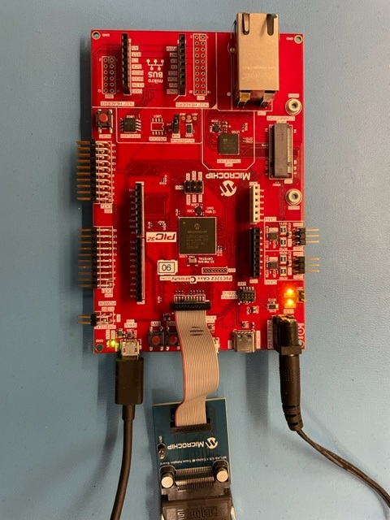

TPDS\_SB\_PIC32CZ\_CA90\_M7\_HSM\_COM
====================================================

Introduction
------------------------
This project tests the HSM Mailbax (MB) Command API Library 
as it is being developed of the PIC32CZi\_CA90 MCU on the
PIC32CZ\_CAxx Curiosity Ultra (Rev3) board.
This chip has two cores:

   1. M7 Host Core
   2. M0+ Hardware Security Module (HSM) core with a Silex
   Cryptography module.

This project works in conjunction with a separate HSM project 
(hsm\_fimware\_flash\_boot/host\_test/host\_firmware\_boot.X) 
that loads the M0+ HSM firmware to host flash.  This allow
the host to boot the HSM at runtime by loading the HSM firmware
from flash through the Host/HSM Mailbox (MB) interface.

Alsok The host sends commands
to the M0+ through the HSM MB registers, which are
shared between the two cores.  Command results/status are
returns through the MB registers and via DMA transfers
to/from the HSM module.

Note that KIT protocol HID connection is supported, but not
impleneted, for receiving Kit Commands over HID
This is not yet operational, since the TPDS KIT Command Driver is 
not yet implemented for HSM devices or command structure.

Hardware Setup
------------------
Two USB ports are used, which both must be connected:    

1. PKOB4 Debug Com Port over Debug USB Connector 
2. Kit Protocol HID connection over USB Device Connector
(required for operation, but not used)

Currently, the project is programmed only with the ICD 4 
using the "Cortex Debug" connector. 

Note that USB power is not used by this board. Power is only
supplied via the barrel connector.

TOOLS
------

ICD4 Toolpack: 1.9.1283 (both projects)    
PIC32CZ\_CA90\_DFP: 1.0.18   (Both Cores)    

Running the Project
-------------------

### Loading Host Flash
The HSM Firmware must first be loaded into the host flash memory.  This is 
performed using the project 
hsm\_firmware\_flash\_boot/host\_proj/firmware_boot.X
Run this project to load the HSM firmware image to host flash memory.  The
Host processor can then use this image to boot the HSM processor via
the HSM MB interface.

NOTE:  This has to be run when the firmware flash memory is initialized,
and/or cleared, or otherwise overwritten.  
The host demo protects this area of flash memory.

### HSM Demo
The HSM Demo performs some of the basic functions of the HSM and contains
the initial development of the HSM MB Command API Library.  Each of these 
implemented library functions is used to test the HSM firmware.

#### Flash Boot
When executing correctly, you should see the following output prior to the
running of the HSM Tests

>> Application created Dec 20 2022 16:38:46 initialized!    
>> SECURE BOOT (from flash)    
>> HSM TEST SUITE Commands    
>> HSM Enabled    
>> USB_DEVICE_EVENT_POWER_DETECTED    
>> USB_DEVICE_EVENT_RESET    
>> USB_DEVICE_EVENT_DEconfigured    
>> USB_DEVICE_EVENT_CONFIGURED    
>>     
>> HSM FLASH BOOT: Waiting for HSM FIRMWARE to be ready    
>> HSM Firmware Metadata:  0x00000110 00050000 00000001 0c7e0000...    
>>          HSM Firmware:  0x1001fff0 100122f5 100174c1 100174c3...    
>> HSM Load Firmware...    
>> HSM Pass: MB Header Match OK:    
>> HSM Pass: CMD Header Match OK:    
>> HSM Pass: RC OK(Command was successful):    
>>    
>> HSM STATUS - NOT busy ECODE:UNDETERM SBS:DISABLED LCS:OPEN PS:OPERATIONAL:    
>>    
>> HSM Pass: Reg. STATUS OK:    
>> **HSM Load Firmware Complete**    
>>    
>> APP IDLE HSM Status: 0x00001320    
>>     NOT busy  ECODE: UNDETERM    
>>     SBS: DISABLED  LCS: NOT_SECURED  PS: OPERATIONAL    

If 0xFFFFFFF is reported for the Metadata or Firmware data, the HSM Firmware
flash has not been loaded.

#### HSM Demo

A few tests of each HSM MB API Command function are executed as part
of this demo.    

#### HSM Demo Implementation

The HSM MB API Library exists under folder hsm_host 

##### HSM Testing Results
NOTE:  Not all of these tests pass.

1. ##### *Hashing*    
    a. Firmware Boot Self Test
    b. SHA256        

with results:

>> \---------------------------------------------------------    
>> **HSM (CMD_BOOT_SELF_TEST)**
>> HSM Pass: MB Header Match OK:    
>> HSM Pass: CMD Header Match OK:    
>> HSM Pass: RC OK(Command was successful):    
>> HSM STATUS - NOT busy ECODE:UNDETERM SBS:DISABLED LCS:OPEN PS:OPERATIONAL:    
>> HSM Pass: Reg. STATUS OK:    
>> BOOT SHA256:    
>>     SG ADDR: 0x20025058 (32 bytes)    
>>     0x6a09e667 0xbb67ae85 0x3c6ef372 0xa54ff53a     
>>     0x510e527f 0x9b05688c 0x1f83d9ab 0x5be0cd19     
>> HSM ROM Test: CMD_BOOT_SELF_TEST Successful.    
>>    
>> \---------------------------------------------    
>> **HSM HASH BLOCK SHA256 TEST**    
>> SHA256:  Msg of 11 Bytes:    
>> b"/0x61/62/63/64/65/66/67/68/69/6a/6b/    
>> HSM: Sending CMD_HASH_BLOCK command    
>> HSM Pass: MB Header Match OK:    
>> HSM Pass: CMD Header Match OK:    
>> HSM Pass: RC OK(Command was successful):    
>> HSM STATUS - NOT busy ECODE:UNDETERM SBS:DISABLED LCS:OPEN PS:OPERATIONAL:    
>> HSM Pass: Reg. STATUS OK:    
>> SHA256 Pass: CMD_VSM_INPUT_DATA terminated properly.    
>>   SHA256:  (32 Bytes)    
>> b"/0xca/2f/20/69/ea/0c/6e/46/58/22/2e/06/f8/dd/63/96/59/cb/b5/e6/7c/bb/ba/67/34/bc/33/4a/37/99/bc/68/    
>> SHA256 Pass: CMD_HASH_BLOCK DATA OUT VALID    
>> HSM: CMD_HASH_BLOCK SHA256 Complete    

2. ##### *Variable Slot (VS) Management*    
    a. Input Data (unencrypted raw and key data)
       - Writes data to VS from host memory    
    b. Output Data (raw and key) 
       - Reads data from VS to host memory    
    c. Delete Slot Data - Delete VS Data
    d. Variable Slot Info - Read VS Info

    with results:

>>     ---------------------------------------------    
>> **CMD_VSM_INPUT_DATA TEST (Slot 15)**    
>> HSM Pass: MB Header Match OK:    
>> HSM Pass: CMD Header Match OK:    
>> HSM Pass: RC OK(Command was successful):    
>> HSM STATUS - NOT busy ECODE:UNDETERM SBS:DISABLED LCS:OPEN PS:OPERATIONAL:    
>> HSM Pass: Reg. STATUS OK:    
>> VSM Pass: CMD_VSM_INPUT_DATA terminated properly.    
>>     
>> CMD_VSM_GET_SLOT_INFO (VSS 15)    
>> VSS Slot# 15 - Data Size 16 bytes    
>> VS #15 Info:    
>>     
>>   VSS HeadXX: 0x0000000f    
>> This should be VS Header Info,    
>> -->not the just the slot number    
>> VS Header (0x0000000f) Slot #15     
>> --    VS Slot #15    
>> --        Type: ERASED    
>> --Storage Type: VM_STORAGE    
>> --E=0 V=0 H=0 APL=0    
>>     
>>   VSS Before: 0x00000000    
>>   VSS  After: 0xffffffff    
>>   VSS   Meta: 0x00000020    
>> VSM Pass: Slot# 15 Written    
>> HSM TEST: MD_VSM_INPUT_DATA Slot 15 Complete    
>>     
>> ---------------------------------------------    
>> **HSM CMD_VSM_OUTPUT_DATA TEST (SLOT #15)**    
>> --SLOT #15 Not Empty    
>> -->Send CMD_VSM_OUTPUT_DATA    
>> ****HSM Cmd Response Checks****    
>> HSM Pass: MB Header Match OK:    
>> HSM Pass: CMD Header Match OK:    
>> HSM Pass: RC OK(Command was successful):    
>> HSM STATUS - NOT busy ECODE:UNDETERM SBS:DISABLED LCS:OPEN PS:OPERATIONAL:    
>> HSM Pass: Reg. STATUS OK:    
>> VSM Pass: CMD_VSM_OUTPUT_DATA terminated properly.    
>> VSM FAIL: Output Data (13 words != Input Data(12 Bytes)    
>>     
>> **NOTE**: VSM Output VS Header is incorrect    
>> --Instead it only gives the slot number (shown below)**    
>> ---VS Header Info:  0x0000000f IS NOT VALID    
>> VS Header (0x0000000f) Slot #15     
>> --    VS Slot #15    
>> --        Type: ERASED    
>> --Storage Type: VM_STORAGE    
>> --E=0 V=0 H=0 APL=0    
>> VSM FAIL: VSM_CMD_OUTPUT_DATA Command Return Value    
>> ...Checking Data (13 Words    
>> )**NOTE:  Initial word should be VS Metadata    
>>          -->Not the Slot Number 0x000f shown below    
>> VSM FAIL:  Data Error @ i=12    
>>     
>> Actual: VSM Output Data(13 Words):    
>>     
>> 0000: 0000000f  00000000  ffffffff  00000020     
>> 0004: 12345670  9abcdef0  12345671  9abcdef1     
>> 0008: 12345672  9abcdef2  12345673  9abcdef3     
>> 000c: 00000000     
>> Expected: VSM Input Data(12 Words):    
>>     
>> 0000: VSMETADA 00000000  ffffffff  00000020     
>> 0004: 12345670  9abcdef0  12345671  9abcdef1     
>> 0008: 12345672  9abcdef2  12345673  9abcdef3     
>> HSM: CMD_VSM_OUTPUT Complete    
>>     
>> ---------------------------------------------    
>> **HSM VSM DELETE SLOT DATA TEST**    
>> --SLOT #15 NOT EMPTY!!!    
>> HSM: Sending CMD_VSM_DELETE_SLOT Command (VSS 15)    
>> --CMD INP[2]: 0x0f000f00    
>> --CMD INP[2]: 0x0f000f00    
>> HSM: RC 0x00000001 Command was successful    
>> HSM Pass: MB Header Match OK:    
>> HSM Pass: CMD Header Match OK:    
>> HSM Pass: RC OK(Command was successful):    
>> HSM STATUS - NOT busy ECODE:UNDETERM SBS:DISABLED LCS:OPEN PS:OPERATIONAL:    
>> HSM Pass: Reg. STATUS OK:    
>> HSM Cmd: CMD_VSM_DELETE_SLOT_INST terminated properly.    
>> CHECK SLOT 15 Empty STATUS:    
>> --HSM PASS: Slot #15 EMPTY after delete    
>> HSM: TEST CMD_VSM_DELETE_SLOT Complete    
>>     
>> ---------------------------------------------    
>> **CMD_VSM_INPUT_DATA TEST (AES ECB KEY 16 bytes, Slot 15)**    
>> HSM Pass: MB Header Match OK:    
>> HSM Pass: CMD Header Match OK:    
>> HSM Pass: RC OK(Command was successful):    
>> HSM STATUS - NOT busy ECODE:UNDETERM SBS:DISABLED LCS:OPEN PS:OPERATIONAL:    
>> HSM Pass: Reg. STATUS OK:    
>> VSM Pass: CMD_VSM_INPUT_DATA terminated properly.    
>>     
>> CMD_VSM_GET_SLOT_INFO (VSS 15)    
>> VSS Slot# 15 - Data Size 16 bytes    
>> VS #15 Info:    
>>     
>>   VSS HeadXX: 0x0100000f    
>> This should be VS Header Info,    
>> -->not the just the slot number    
>> VS Header (0x0100000f) Slot #15     
>> --    VS Slot #15    
>> --        Type: ERASED    
>> --Storage Type: VM_STORAGE    
>> --E=0 V=0 H=0 APL=0    
>>     
>>   VSS Before: 0x00000000    
>>   VSS  After: 0xffffffff    
>>   VSS   Meta: 0xfffff0c8    
>> VSM Pass: Slot# 15 Written    
>> HSM TEST: MD_VSM_INPUT_DATA Slot 15 Complet    

3. ##### *AES Encryption/Decryption*    

    a. AES ECB (encryption) - Encrypt message with streamed key 
    
    with results:    
    
>> **HSM AES256 ECB Encryption/Decryption TEST (Slot -1)**    
>> Key (16 Bytes):    
>> b"/0x61/62/63/64/65/66/67/68/69/6a/6b/6c/6d/6e/6f/70/    
>> Msg (32 Bytes):     
>> TechTutorialsX!!TechTutorialsX!!    
>> b"/0x54/65/63/68/54/75/74/6f/72/69/61/6c/73/58/21/21/54/65/63/68/54/75/74/6f/72/69/61/6c/73/58/21/21/    
>> HSM: Sending CMD_AES_ENCRYPT command (msg L=8 words    
>> HSM Pass: MB Header Match OK:    
>> HSM Pass: CMD Header Match OK:    
>> HSM Pass: RC OK(Command was successful):    
>> HSM STATUS - NOT busy ECODE:UNDETERM SBS:DISABLED LCS:OPEN PS:OPERATIONAL:    
>> HSM Pass: Reg. STATUS OK:    
>> AES256 Pass: CMD_VSM_INPUT_DATA terminated properly.    
>> AES256:  Encrypted MSG (8 Words)    
>> b"/0x11/d0/4b/87/76/94/92/04/df/bf/7f/5a/3c/7b/1c/40/11/d0/4b/87/76/94/92/04/df/bf/7f/5a/3c/7b/1c/40/    
>> AES 256 FAIL: !!!CMD_AES Encryption ERROR !!!    
>> Expected: Encrypted MSG (8 Words)    
>> b"/0x17/5a/a7/ea/1d/ec/81/b6/8d/6f/1c/d3/03/16/e7/e6/17/5a/a7/ea/1d/ec/81/b6/8d/6f/1c/d3/03/16/e7/e6/    
>> HSM: CMD_AES_256 Encrypt/Decrypt Complete    
>>     
>> ---------------------------------------------    
>> **HSM AES256 ECB Encryption/Decryption TEST G1 T2 (Slot -1)**    
>> Key (16 Bytes):    
>> b"/0x00/00/00/00/00/00/00/00/00/00/00/00/00/00/00/00/    
>> Msg (16 Bytes):     
>> b"/0xf3/44/81/ec/3c/c6/27/ba/cd/5d/c3/fb/08/f2/73/e6/    
>> HSM: Sending CMD_AES_ENCRYPT (G1T2) command (msg L=4 words    
>> HSM Pass: MB Header Match OK:    
>> HSM Pass: CMD Header Match OK:    
>> HSM Pass: RC OK(Command was successful):    
>> HSM STATUS - NOT busy ECODE:UNDETERM SBS:DISABLED LCS:OPEN PS:OPERATIONAL:    
>> HSM Pass: Reg. STATUS OK:    
>> AESG1T2 Pass: CMD_VSM_INPUT_DATA terminated properly.    
>> AESG1T2:  Encrypted MSG (4 Words)    
>> b"/0x67/9f/80/20/e5/db/96/e4/78/c6/e5/23/9d/db/d9/09/    
>> AES G1T2 FAIL: !!!CMD_AES Encryption ERROR !!!    
>> Expected: Encrypted MSG (4 Words)    
>> b"/0x03/36/76/3e/96/6d/92/59/5a/56/7c/c9/ce/53/7f/5e/    
>> HSM: CMD_AES_Encrypt G1T2 Complete    
    
NOTES:
------

REFERENCES
----------

1. PIC32CZ CA80/CA90 Family Specification (60001749A.pdf) 
2. HSM Firmware Specification Rev C.2
2. HSM DOS (sec_hsm_v1_DOS03785)
